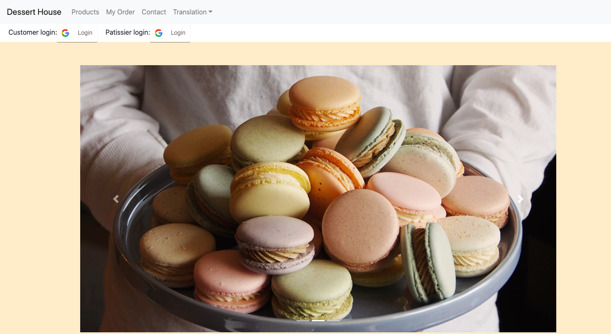
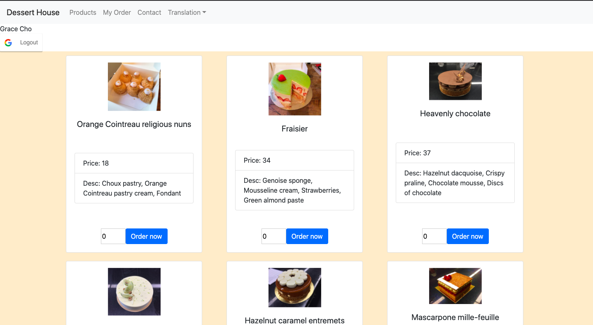
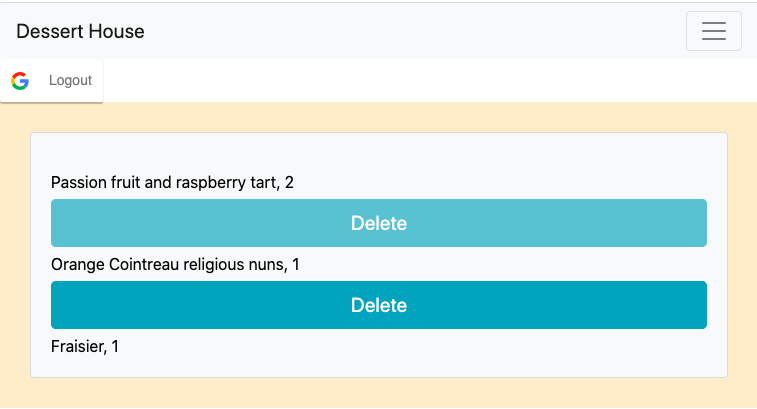
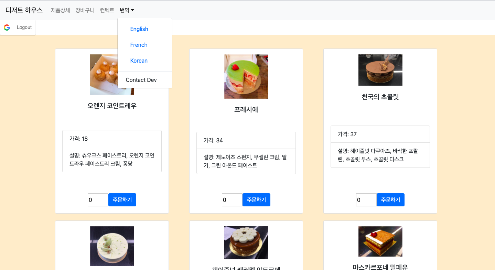

# Project 3 - Order Dssert Application

Dessert house is a web application that allows user to order the dessert they want. 
Users can order through Google Login but if they don't login, they can only check the dessert menu.

## How to Use Dessert House App

1. When first arriving at our site, users can use this webpage through Google Login.

2. In products, the user selects the menu and quantity and presses the order button.

3. Users can check and delete from the My Order page. 

4. Users can choose from three languages (English, French, and Korean) to view the Web page. 

5. Patissier can log in to the Patissier page and view and complete the customer's order.

### Technologies, Libraries, and NPM Packages Used

* **React.js**, **React-router-dom**, **MongoDB**, **Mongoose**, **Axios**, **React Bootstrap**, **CSS**, **React-Google-Login**

* **react-google-login** - Authentication of user login information

#### Future Features Include
* Add a user database where each row, or, data, represents a user. User will have several fields, like UserID, name, and whether this person is a partissier or not.

* Add a payment system for customer to pay their order.